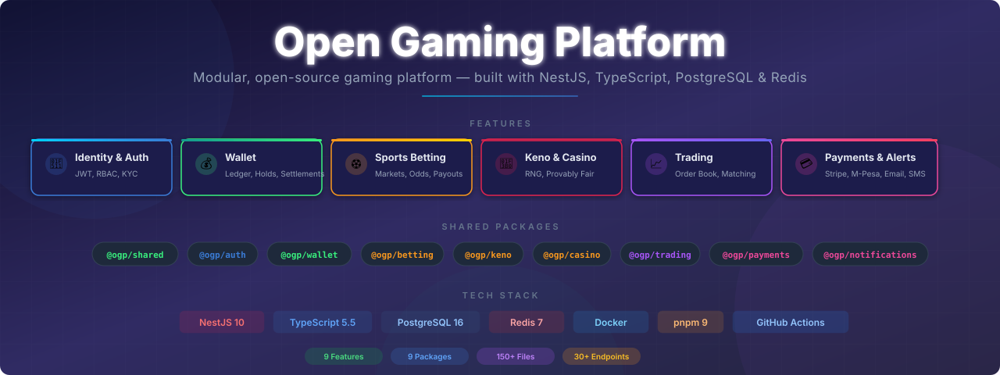

<p align="center">
  
</p>

# Open Gaming Platform

An open-source, modular gaming platform supporting Sports Betting, Keno, Casino, Trading, and Payments — built with NestJS, TypeScript, PostgreSQL, and Redis.

## Architecture

**V1: Hybrid Monorepo** — Ship fast with clear domain boundaries, independently deployable apps, and a zero-rewrite migration path to microservices.

📖 **[Full Architecture Guide →](./docs/architecture.md)**

## Tech Stack

- **Framework:** NestJS 10 + TypeScript 5.5
- **Database:** PostgreSQL 16 (schema-per-domain)
- **Cache / Events:** Redis 7 (cache, sessions, pub/sub, distributed locks)
- **API Gateway:** Nginx
- **Monorepo:** pnpm 9 workspaces
- **Containers:** Docker / Docker Compose
- **CI/CD:** GitHub Actions

## Features

| Feature | Description | Status |
|---------|-------------|--------|
| **Identity & Auth** | Registration, login, JWT tokens, roles, KYC, session management | ✅ |
| **Wallet** | Multi-currency balances, double-entry ledger, holds & settlements | ✅ |
| **Sports Betting** | Markets, bet slips, odds conversion, risk checks, payouts | ✅ |
| **Keno** | Crypto RNG draws, configurable payout tables, live games | ✅ |
| **Casino** | Plugin-based game interface, provably fair verification | ✅ |
| **Trading** | Order book, matching engine, risk management, positions | ✅ |
| **Payments** | Stripe & M-Pesa integration, deposits, refunds | ✅ |
| **Notifications** | Email, SMS, push, and in-app delivery channels | ✅ |
| **Admin Dashboard** | User management, reports, platform oversight | ✅ |

## Packages

| Package | Description | Status |
|---------|-------------|--------|
| `@ogp/shared` | Config, logging, errors, pagination, Redis, decorators | ✅ 30 files |
| `@ogp/auth` | JWT guards, RBAC, password hashing, refresh tokens | ✅ 17 files |
| `@ogp/wallet` | Double-entry ledger, balance calculation, fund holds | ✅ 16 files |
| `@ogp/betting` | Odds conversion, slip validation, payout calculation | ✅ 12 files |
| `@ogp/keno` | Crypto RNG draw engine, configurable payout tables | ✅ 8 files |
| `@ogp/casino` | ICasinoGame plugin interface, provably fair service | ✅ 5 files |
| `@ogp/trading` | Order book (Redis), matching engine, risk checks | ✅ 14 files |
| `@ogp/payments` | Stripe & M-Pesa provider adapters | ✅ 9 files |
| `@ogp/notifications` | Email, SMS, Push, In-App delivery channels | ✅ 10 files |

## API Endpoints

### Identity (`:3001`)
| Method | Path | Auth | Description |
|--------|------|------|-------------|
| `POST` | `/v1/auth/register` | Public | Register new user |
| `POST` | `/v1/auth/login` | Public | Login, get tokens |
| `POST` | `/v1/auth/refresh` | Public | Refresh access token |
| `POST` | `/v1/auth/logout` | Protected | Revoke refresh token |
| `GET` | `/v1/users/:id` | Admin | Get user |
| `GET` | `/v1/users` | Admin | List users |
| `POST` | `/v1/users` | Admin | Create user |
| `PATCH` | `/v1/users/:id` | Protected | Update user |

### Wallet (`:3002`)
| Method | Path | Auth | Description |
|--------|------|------|-------------|
| `POST` | `/v1/wallets` | Admin | Create wallet |
| `GET` | `/v1/wallets/user/:userId` | Protected | List user wallets |
| `GET` | `/v1/wallets/:id/balance` | Protected | Get balance |
| `POST` | `/v1/internal/wallet/hold` | Internal | Reserve funds |
| `POST` | `/v1/internal/wallet/settle` | Internal | Settle hold |
| `POST` | `/v1/internal/wallet/credit` | Internal | Direct credit |

### Gaming (`:3003`)
| Method | Path | Auth | Description |
|--------|------|------|-------------|
| `GET` | `/v1/betting/markets` | Public | List markets |
| `POST` | `/v1/betting/slips` | Protected | Place bet |
| `GET` | `/v1/keno/current` | Public | Current game |
| `POST` | `/v1/keno/tickets` | Protected | Buy ticket |
| `GET` | `/v1/casino/games` | Public | List casino games |
| `POST` | `/v1/casino/games/:id/rounds` | Protected | Start round |

### Trading (`:3004`)
| Method | Path | Auth | Description |
|--------|------|------|-------------|
| `POST` | `/v1/orders` | Protected | Place order |
| `GET` | `/v1/orders` | Protected | My orders |
| `DELETE` | `/v1/orders/:id` | Protected | Cancel order |

### Admin (`:3005`)
| Method | Path | Auth | Description |
|--------|------|------|-------------|
| `GET` | `/v1/admin/dashboard` | Admin | Dashboard stats |
| `GET` | `/v1/admin/users` | Admin | List all users |
| `GET` | `/v1/admin/users/:id` | Admin | User detail |
| `POST` | `/v1/admin/users/:id/status` | Admin | Update user status |

## Quick Start

```bash
# Install dependencies
pnpm install

# Start infrastructure (PostgreSQL + Redis)
docker compose -f infrastructure/docker/docker-compose.yml up postgres redis -d

# Copy and configure environment
cp .env.example .env

# Build all packages
pnpm run build

# Start apps (dev mode)
pnpm run dev:identity    # :3001
pnpm run dev:wallet      # :3002
pnpm run dev:gaming      # :3003
pnpm run dev:trading     # :3004
pnpm run dev:admin       # :3005
```

## Project Structure

```
open-gaming-platform/
├── apps/
│   ├── identity-api/       # Auth, users, KYC, sessions
│   ├── wallet-api/         # Balances, ledger, holds
│   ├── gaming-api/         # Betting, Keno, Casino
│   ├── trading-api/        # Order book, trades, positions
│   └── admin-api/          # Back-office dashboard
├── packages/
│   ├── shared/             # Config, Redis, errors, logger, decorators
│   ├── auth/               # JWT, guards, password, refresh tokens
│   ├── wallet/             # Ledger, balance calculator, holds
│   ├── betting/            # Odds, validation, payout
│   ├── keno/               # RNG draw, payout tables
│   ├── casino/             # Plugin interface, provably fair
│   ├── trading/            # Order book, matching, risk
│   ├── payments/           # Stripe, M-Pesa adapters
│   └── notifications/      # Email, SMS, Push, In-App
├── infrastructure/
│   ├── docker/             # Docker Compose (prod + dev)
│   ├── nginx/              # API gateway config
│   └── postgres/           # Schema initialization
├── docs/                   # Architecture guide, ADRs
└── .github/workflows/      # CI/CD pipelines
```

## CI/CD

| Workflow | Trigger | Description |
|----------|---------|-------------|
| `ci.yml` | Push/PR to main/develop | Build all packages + apps, run tests |
| `cd-identity.yml` | Push to main (identity paths) | Build & deploy identity-api |
| `cd-wallet.yml` | Push to main (wallet paths) | Build & deploy wallet-api |
| `cd-gaming.yml` | Push to main (gaming paths) | Build & deploy gaming-api |
| `cd-trading.yml` | Push to main (trading paths) | Build & deploy trading-api |
| `cd-admin.yml` | Push to main (admin paths) | Build & deploy admin-api |

## Testing

```bash
# Run all tests
pnpm run test

# Run specific app tests
pnpm --filter identity-api test
pnpm --filter wallet-api test

# Run with coverage
pnpm --filter identity-api test:cov
```

## Domain Boundaries

1. **No cross-domain database queries** — gaming-api never queries the wallet schema
2. **No cross-domain package imports** — packages/betting never imports from packages/wallet
3. **All cross-domain calls use HTTP or events** — no direct function calls across domains
4. **Wallet is the single source of truth for money** — no domain stores its own balance

## Documentation

- [Architecture Guide](./docs/architecture.md)
- [System Architecture Evolution V1](./docs/system-architecture-evolution-v1.md)
- [ADR-001: Monorepo Strategy](./docs/adr/001-monorepo-strategy.md)
- [ADR-002: Database Strategy](./docs/adr/002-database-per-domain.md)
- [ADR-003: Event Bus Strategy](./docs/adr/003-event-bus-strategy.md)
- [Contributing Guide](./CONTRIBUTING.md)

## License

MIT
